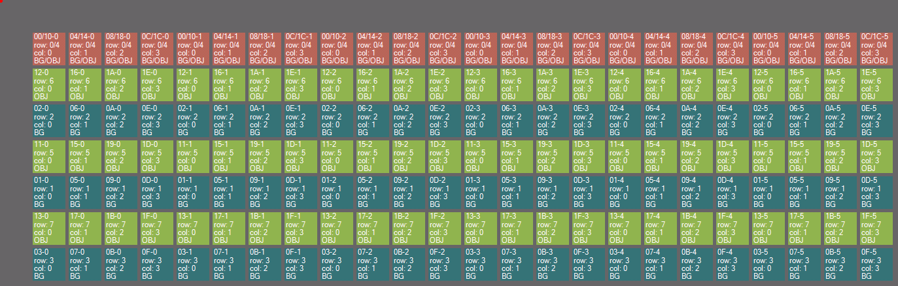
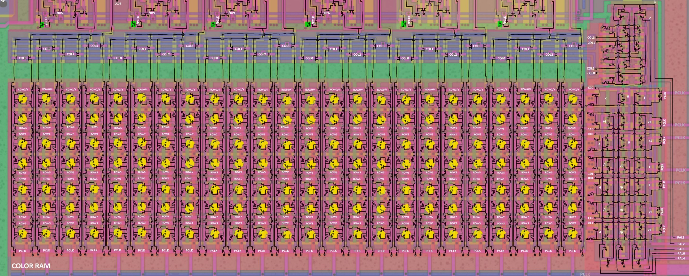

# CRAMMap

A simple utility for generating PPUs Color RAM (palette) memory cells layout.

The map is presented as a set of squares, each square corresponds to one physical location of a memory cell on the chip.

Keep in mind that Color RAM is designed so that 0x0/0x4/0x8/0xC and 0x10/0x14/0x18/0x1C addresses point to the same memory cells (Mirroring).

Color differentiation of memory cells:
- Tomato: Cells for which Mirroring is applied (same colors for background/sprite)
- GreenYellow: Cells for sprite color (CRAM Address msb = 1)
- Teal: Cells for the color of the background (CRAM Address msb = 0)

Inside each cell is a caption, of the form `AA-B`:
- AA: Cell address 00-FF
- B: The bit number of the corresponding byte.

Here's what it turns out:

(open the picture in a new tab)

## How to view the map

The utility creates an .xml file, which should be opened in the Deroute utility (File -> Add entities...)

https://github.com/emu-russia/psxdev/releases

## Color RAM Schematic

Just in case, a transistor circuit of the Color RAM:

From left to right Color Buffer bits: CC0 (0), CC1 (1), CC2 (2), CC3 (3), LL0 (4), LL1 (5)
