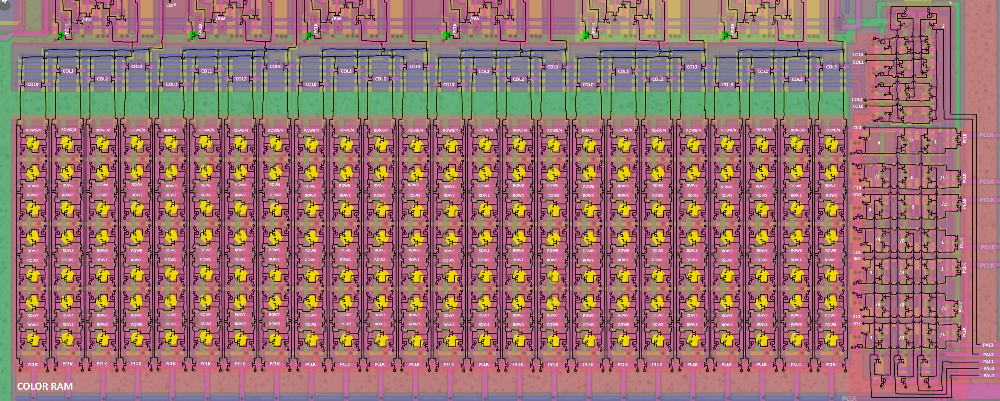

# CRAMMap

Простая утилита для генерации карты памяти ячеек памяти Color RAM PPU (палитры).

Карта представляется в виде набора квадратов, каждый квадрат соответствует одному физическому расположению ячейки памяти на чипе.

Имейте ввиду, что Color RAM устроена так, что адреса 0x0/0x4/0x8/0xC и 0x10/0x14/0x18/0x1C указываются на одни и теже ячейки памяти (Mirroring).

Цветовая дифференциация ячеек памяти:
- Tomato: Ячейки для которых применяется Mirroring (одинаковые цвета для бэкграунда/спрайта)
- GreenYellow: Ячейки для цвета спрайтов (CRAM Address msb = 1)
- Teal: Ячейки для цвета бэкграунда (CRAM Address msb = 0)

Внутри каждой ячейки находится подпись, вида `AA-B`:
- AA: Адрес ячейки 00-1F
- B: Номер бита соответствующего байта.

Вот что получается:

(открывайте картинку в новой вкладке)

## Как смотреть карту

Утилита создает .xml файл, который нужно открывать в утилите Deroute (File -> Add entities...)

https://github.com/emu-russia/psxdev/releases

## Схема Color RAM

На всякий случай транзисторная схема Color RAM:

Слева направо разряды Color Buffer: CC0 (0), CC1 (1), CC2 (2), CC3 (3), LL0 (4), LL1 (5)
